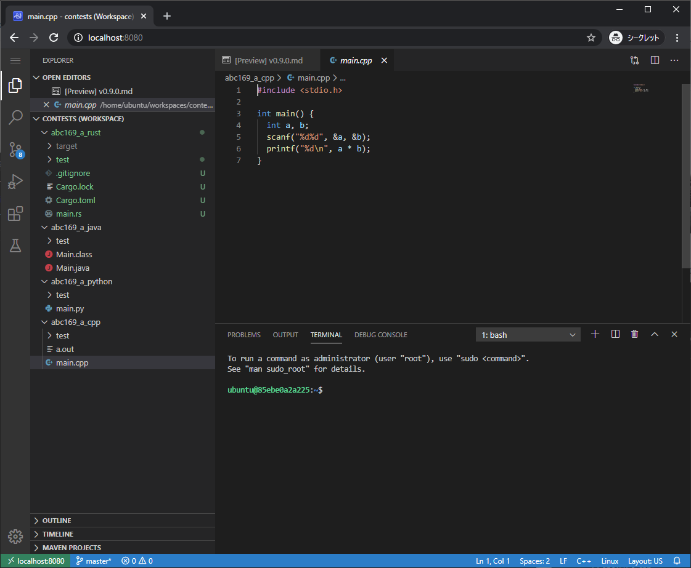
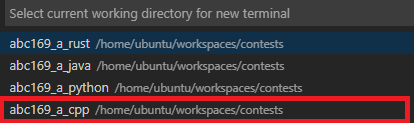

# Code-server container for Competitive Programming.


競技プログラミングの環境をコンテナにまとめたものです。



具体的には下記の言語のコンパイラ及び各種ツール一式がパックされており、ブラウザからコーディングできるようcode-serverを起動します。

- C/C++ (GCC/Clang)
- Python3
- Rust
- .NET
- Java
- Kotlin
- Scala
- [code-server](https://github.com/cdr/code-server)
- [Online Judge Tools](https://github.com/online-judge-tools/oj)
- [cargo-atcoder](https://github.com/tanakh/cargo-atcoder)


## 使い方

```bash
docker run -d -p 8080:8080 hiromiayase/competitive-programming-env:0.1.0
```
上記のコマンドを起動した後、ブラウザで http://localhost:8080 にアクセスする。

## C++ による提出

(ABC169)[https://atcoder.jp/contests/abc169/tasks/abc169_a] のコードがサンプルとして abc196_a_cpp にあります。まず、Ctrl+Shift+@ により abc196_a_cpp でターミナルを開きます。




ターミナルが開いたら Online Judge Tools でテストケースをダウンロードします。
```bash
oj d https://atcoder.jp/contests/abc169/tasks/abc169_a
```

テストケースがダウンロードできたらコンパイルしテストしてみます。
```bash
g++ main.cpp && oj t
```
[+] test success: 2 cases とでたら成功です。


## Java による提出

(ABC169)[https://atcoder.jp/contests/abc169/tasks/abc169_a] のコードがサンプルとして abc196_a_java にあります。まず、Ctrl+Shift+@ により abc196_a_java でターミナルを開きます。


ターミナルが開いたら Online Judge Tools でテストケースをダウンロードします。
```bash
oj d https://atcoder.jp/contests/abc169/tasks/abc169_a
```

テストケースがダウンロードできたらコンパイルしテストしてみます。
```bash
javac Main.java && oj t -c "java Main"
```
C++と異なり、-C オプションによる実行コマンドの指定が必要です。

[+] test success: 2 cases とでたら成功です。


# その他

iPad Proはもってませんが、ブラウザ上で動くのでiPadで競プロが出来るようになるかもしれません。誰か試してください。
